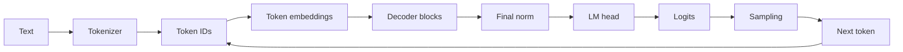

# Transformer and Hugging Face Foundations

> **Role:** connect next-token modeling to a working decoder-only Transformer
>
> **Prerequisite:** [`01-ai-ml-foundations.md`](01-ai-ml-foundations.md) or equivalent knowledge
>
> **Outcome:** understand both the architecture and the Hugging Face model interface used by real systems

[Roadmap index](README.md) ·
[Overview](00-roadmap.md) ·
[AI/ML foundations](01-ai-ml-foundations.md) ·
[Modern architecture](03-modern-llm-architecture.md) ·
[Competency gates](COMPETENCY-GATES.md)

---

## Transformer Execution Map



### Document guide

| Section | Focus |
|---|---|
| 1 | tokens, language modeling, and embeddings |
| 2 | attention from Q/K/V to multi-head execution |
| 3 | the complete decoder block |
| 4 | training, prefill, decode, generation, and KV cache |
| 5 | Hugging Face Transformers |
| 6 | minimal implementation and exit gate |

---

## 1. Tokens and Language Modeling

### 1.1 Text is not the model input

The model consumes integer token IDs:

```text
text
→ tokenizer
→ token IDs
→ model
→ next-token logits
```

Token boundaries need not align with words. Token count—not character count—primarily controls:

- prefill compute;
- KV/state footprint;
- context-window occupancy;
- serving cost and billing.

### 1.2 Tokenizer components

Know the role of:

- vocabulary;
- token-to-ID mapping;
- BPE/SentencePiece-style segmentation;
- byte fallback;
- special tokens;
- BOS/EOS/PAD tokens;
- chat templates;
- attention masks.

Two prompts that look identical can tokenize differently because of normalization, special tokens,
or chat templates. Prefix caching must key on the effective token sequence and model context.

### 1.3 Next-token objective

For sequence `x_1, ..., x_T`:

```text
P(x_1, ..., x_T) = Π_t P(x_t | x_<t)
```

Training examples use a shifted target:

```text
input : x_1 x_2 x_3 ... x_(T-1)
target: x_2 x_3 x_4 ... x_T
```

The model outputs one vocabulary-logit vector per selected position.

### 1.4 Embeddings

For vocabulary size `V` and hidden dimension `d`:

```text
embedding table: [V, d]
token IDs:       [B, T]
embeddings:      [B, T, d]
```

An embedding lookup selects rows; it is not the same execution shape as multiplying a one-hot
matrix, even though the mathematics is equivalent.

Inspect whether:

- input embedding and output head share weights;
- vocabulary is tensor-parallel;
- only final-position logits are computed during decode.

---

## 2. Attention

### 2.1 Why attention exists

Each token needs a context-dependent representation. Attention lets a query position retrieve
information from allowed key/value positions.

For hidden states `X`:

```text
Q = XW_Q
K = XW_K
V = XW_V
```

Then:

```text
scores  = QKᵀ / sqrt(d_head)
weights = softmax(scores + mask)
output  = weights V
```

### 2.2 Shapes

For batch `B`, sequence length `T`, model width `d`, head count `H`, and head width `Dh`:

```text
X : [B, T, d]
Q : [B, H, T, Dh]
K : [B, Hkv, T, Dh]
V : [B, Hkv, T, Dh]
```

With conventional multi-head attention, `Hkv = H`. GQA and MQA reduce `Hkv`.

### 2.3 A two-token, one-head example

Given:

```text
Q = [[1, 0],
     [0, 1]]

K = [[1, 0],
     [1, 1]]

V = [[2, 0],
     [0, 4]]
```

For the first causal position, only token 1 is visible, so its attention output is `V_1`.
For the second position, compute its dot products with both keys, scale, softmax, and take the
weighted sum of both value vectors.

Do this once by hand. It establishes what a row of the attention matrix means and how causal masking
changes the probability distribution.

### 2.4 Causal masking

A decoder token at position `t` may attend only to positions `≤ t`:

```text
allowed:  past and current positions
blocked:  future positions
```

Masking usually adds a large negative value to forbidden logits before softmax.

Padding masks and causal masks serve different purposes:

- padding mask hides non-content padding;
- causal mask prevents future information leakage.

### 2.5 Multi-head attention

Multiple heads provide separate projection subspaces:

```text
head_h = Attention(Q_h, K_h, V_h)
output = Concat(head_1, ..., head_H) W_O
```

Record:

- query-head count;
- KV-head count;
- head width;
- projection layout;
- head-to-KV-group mapping;
- output projection.

### 2.6 Positional information

Attention alone is permutation-equivariant. Position mechanisms include:

- absolute position embeddings;
- sinusoidal encoding;
- RoPE;
- ALiBi;
- relative position bias;
- long-context RoPE scaling.

Modern decoder-only LLMs commonly use RoPE. Understand that RoPE rotates query/key pairs by a
position-dependent phase; values are not normally rotated.

### 2.7 Attention cost

For prefill, score computation scales approximately with:

```text
O(B × H × T² × Dh)
```

For one-token decode with existing context length `Tk`:

```text
O(B × H × Tk × Dh)
```

The implementation must also read K/V state. FLOPs alone do not describe decode cost.

---

## 3. Decoder Block

### 3.1 Pre-norm block

Common abstraction:

```text
h = x + Attention(Norm(x))
y = h + FFN(Norm(h))
```

Components:

- normalization;
- attention projections and output projection;
- residual addition;
- feed-forward network;
- second residual addition.

### 3.2 RMSNorm

RMSNorm scales by root-mean-square magnitude:

```text
rms(x) = sqrt(mean(x²) + ε)
y = scale ⊙ x / rms(x)
```

Unlike LayerNorm, RMSNorm does not subtract the feature mean.

### 3.3 Gated FFN / SwiGLU

Typical form:

```text
gate = SiLU(xW_gate)
up   = xW_up
y    = (gate ⊙ up) W_down
```

This introduces three major matrices rather than the two in a basic MLP.

### 3.4 Residual stream

The residual stream keeps hidden width constant across blocks. The attention and FFN outputs must
return to model width before residual addition.

### 3.5 Final normalization and LM head

After the decoder stack:

```text
hidden states
→ final norm
→ LM head
→ vocabulary logits
```

The LM head can become significant for very large vocabularies or very small models.

### 3.6 Parameter ledger

For every block, count:

```text
Q projection
K projection
V projection
attention output projection
FFN gate/up/down matrices
normalization scales
biases if present
```

Then add:

- embeddings;
- final normalization;
- LM head;
- routed/shared experts if MoE.

---

## 4. Training, Prefill, Decode, and Generation

### 4.1 Training

Training commonly processes many tokens in parallel with a causal mask:

```text
full token batch
→ logits for many positions
→ shifted cross entropy
→ backward
→ optimizer update
```

Training retains activations for backward and usually has no persistent request KV cache.

### 4.2 Prefill

Prefill processes the prompt:

```text
prompt tokens
→ parallel decoder execution
→ KV state for every layer and prompt position
→ logits for next-token selection
```

Prefill often forms large GEMMs and attention tiles.

### 4.3 Decode

Decode processes newly generated tokens iteratively:

```text
one new token per active sequence
→ new Q/K/V
→ attend to retained state
→ append new K/V
→ sample
→ repeat
```

Decode has small query length, growing state, dynamic batches, and a serial token dependency.

### 4.4 KV cache correctness

Without caching, the model recomputes K/V for all previous tokens at every step. Because past hidden
states and their K/V projections are unchanged in an ordinary causal decoder, they can be retained.

Per-request capacity:

```text
KV bytes
≈ 2 × layers × KV heads × head dimension
  × retained tokens × bytes per element
```

Caching changes execution, not model semantics. Cached and uncached logits should match within the
declared numerical tolerance.

### 4.5 Autoregressive generation

```text
encode prompt
→ prefill
→ select next token
→ append token
→ decode with cache
→ stop on EOS / length / stopping rule
```

### 4.6 Sampling

Know:

- greedy decoding;
- temperature;
- top-k;
- top-p/nucleus;
- min-p;
- repetition penalties;
- stop tokens and stop strings.

Sampling configuration changes output quality, output length, reproducibility, and speculative
acceptance. It belongs in the workload contract.

---

## 5. Hugging Face Transformers

### 5.1 Repository role

[huggingface/transformers](https://github.com/huggingface/transformers) provides:

- tokenizer implementations;
- model configurations;
- model definitions;
- checkpoint loading;
- generation utilities;
- cache abstractions;
- quantization/backend integration;
- training and inference interfaces.

It is a model-definition framework, not an optimized online serving engine.

### 5.2 Core loading path

```python
from transformers import AutoTokenizer, AutoModelForCausalLM

tokenizer = AutoTokenizer.from_pretrained(model_id)
model = AutoModelForCausalLM.from_pretrained(model_id)
```

Understand what each object loads:

| Object | Important contents |
|---|---|
| tokenizer | vocabulary, merges/model, special tokens, chat template |
| config | layer count, hidden size, heads, KV heads, positional settings, dtype hints |
| model | module graph and parameters |
| generation config | sampling, stopping, and decoding defaults |

### 5.3 Tokenizer inspection

Be able to:

- encode/decode text;
- inspect special token IDs;
- apply the chat template;
- compare raw text length with token length;
- batch and pad sequences;
- inspect attention masks;
- show why two prompt templates cannot share a token-prefix cache.

### 5.4 Configuration inspection

Extract at minimum:

```text
model_type
vocab_size
hidden_size
intermediate_size
num_hidden_layers
num_attention_heads
num_key_value_heads
head_dim
max_position_embeddings
rope settings
attention pattern
MoE fields
dtype / quantization fields
```

### 5.5 Model source path

Trace:

```text
AutoModel class resolution
→ model-family module
→ top-level causal LM
→ decoder model
→ decoder layer
→ attention module
→ MLP/MoE module
→ cache update
```

Do not treat `model.generate()` as a black box.

### 5.6 Forward outputs

Inspect:

- logits;
- hidden states;
- attention outputs when enabled;
- cache object / past key values;
- loss when labels are supplied.

Know which outputs add large memory or synchronization overhead.

### 5.7 Generation path

Trace:

```text
generate()
→ generation configuration
→ input preparation
→ prefill forward
→ logits processors/warpers
→ token selection
→ cache update
→ stopping criteria
→ iterative decode
```

### 5.8 Cache interfaces

Understand:

- legacy tuple-style past key values;
- dynamic/static cache concepts;
- sequence length and retained position;
- cache reordering for beams;
- device/dtype/layout;
- why production engines often replace the framework cache manager.

### 5.9 Common mistakes

- loading a checkpoint without matching tokenizer/chat template;
- relying on model-card architecture descriptions instead of config/source;
- comparing `generate()` latency without warmup or synchronization;
- enabling returned attention matrices and then measuring memory;
- assuming `device_map="auto"` is an optimized serving placement;
- treating quantized loading as proof of an optimized low-bit kernel;
- comparing cached and uncached logits with inconsistent positions or masks.

---

## 6. Required Builds

### Build A — Attention by hand

- calculate a two-token, one-head causal attention output;
- verify it against a small tensor implementation;
- print every intermediate shape.

### Build B — Minimal decoder block

Implement:

```text
RMSNorm
→ causal self-attention
→ residual
→ RMSNorm
→ SwiGLU
→ residual
```

Required evidence:

- shape assertions;
- causal-mask test;
- parameter/FLOP ledger;
- deterministic reference output.

### Build C — Minimal autoregressive model

Add:

- token embedding;
- positional mechanism;
- multiple decoder blocks;
- final norm and LM head;
- shifted cross entropy;
- greedy and sampled generation.

### Build D — KV cache

- implement generation with and without caching;
- verify matching logits;
- measure state bytes per token;
- separate prefill and decode timing.

### Build E — Hugging Face model inspection

For one small open model:

1. tokenize a raw prompt and a chat-template prompt;
2. extract the architecture fields from config;
3. locate attention, MLP, normalization, RoPE, and cache-update source;
4. run forward and generation;
5. inspect logits and cache shapes;
6. compare cached and uncached next-token logits;
7. map framework modules to the corresponding architecture ledger.

---

## Exit Gate

You can:

1. explain tokenization and next-token likelihood;
2. derive Q/K/V, attention-score, output, and KV-cache shapes;
3. compute a small causal-attention example manually;
4. reconstruct a pre-norm decoder block;
5. distinguish training, prefill, and decode;
6. implement autoregressive generation and a correct KV cache;
7. explain sampling and stopping semantics;
8. load and inspect a Hugging Face causal LM without treating `generate()` as opaque;
9. locate model-family and cache code in `transformers`;
10. calculate weight, activation, FLOP, and KV/state costs from a configuration.

---

## Primary Resources

- [`../FOUNDATION/ATTENTION.pdf`](../FOUNDATION/ATTENTION.pdf)
- [The Annotated Transformer](https://github.com/harvardnlp/annotated-transformer)
- [LLMs from Scratch](https://github.com/rasbt/LLMs-from-scratch)
- [Hugging Face Course](https://github.com/huggingface/course)
- [Hugging Face Transformers](https://github.com/huggingface/transformers)
- [Stanford CS336](https://github.com/stanford-cs336/lectures)
- [`../RESOURCES/GITHUB-REPO-ATLAS.md`](../RESOURCES/GITHUB-REPO-ATLAS.md)

---

**Previous:** [`01-ai-ml-foundations.md`](01-ai-ml-foundations.md) ·
**Next:** [`03-modern-llm-architecture.md`](03-modern-llm-architecture.md) ·
**Competency gates:** [`COMPETENCY-GATES.md`](COMPETENCY-GATES.md)
