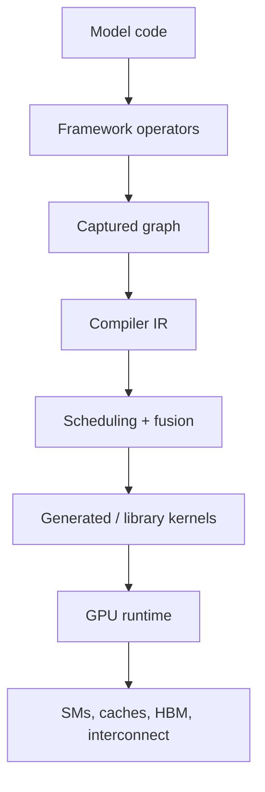

# GPU, Compiler, and Kernel Foundations

> **Role:** explain how Transformer operations become efficient accelerator execution
>
> **Prerequisite:** Transformer shapes and costs from [`02-transformer-foundations.md`](02-transformer-foundations.md)
>
> **Outcome:** predict and verify compute, memory, launch, compilation, and backend bottlenecks

[Roadmap index](README.md) ·
[Modern architecture](03-modern-llm-architecture.md) ·
[Single-node engine](05-single-node-inference-engine.md) ·
[Competency gates](COMPETENCY-GATES.md)

---

## Execution Stack



| Layer | Typical question |
|---|---|
| model/framework | are shapes, dtypes, and operators appropriate? |
| graph compiler | was the graph captured, specialized, fused, and cached? |
| kernel | are tiling, memory access, occupancy, and tensor-core use effective? |
| runtime | are launches, streams, synchronization, and graph replay efficient? |
| hardware | is the limit compute, memory, capacity, topology, or contention? |

---

## 1. Accelerator Hardware Model

### 1.1 CPU and GPU roles

An inference process commonly divides work into:

| CPU/control plane | GPU/data plane |
|---|---|
| API, tokenization, request state | model operators |
| scheduling and batch assembly | attention and GEMM |
| block-table preparation | KV reads/writes |
| kernel launch and synchronization | sampling/fused post-processing |
| networking and streaming | collectives and transfer kernels |

A GPU can be underutilized because the CPU did not prepare work fast enough.

### 1.2 GPU execution hierarchy

Know:

- kernel;
- grid;
- thread block / cooperative thread array;
- warp/wavefront;
- thread;
- streaming multiprocessor / compute unit;
- warp scheduling;
- occupancy;
- register and shared-memory limits.

Occupancy is a constraint and diagnostic—not an objective that must always be maximized.

### 1.3 Memory hierarchy

From smallest/closest to largest/farthest:

```text
registers
→ shared memory / local scratchpad
→ L1
→ L2
→ HBM / device memory
→ peer accelerator
→ host DRAM
→ local storage
→ remote memory/storage
```

For every kernel, ask:

- which bytes are loaded;
- how many times they are reused;
- whether accesses are coalesced;
- whether layout causes gather/scatter;
- whether capacity, bandwidth, or latency dominates.

### 1.4 Tensor cores and matrix units

Tensor cores accelerate supported matrix-multiply shapes and dtypes. Performance depends on:

- tile alignment;
- matrix dimensions;
- accumulation dtype;
- data layout;
- batch/group size;
- sparsity/quantization support;
- software-library path.

Theoretical peak FLOPs are irrelevant when shapes cannot use the fast path.

---

## 2. Performance Cost Model

### 2.1 Roofline

```text
arithmetic_intensity = FLOPs / bytes_moved

attainable_compute
= min(peak_compute,
      arithmetic_intensity × memory_bandwidth)
```

Interpretation:

- low arithmetic intensity tends toward bandwidth limitation;
- high arithmetic intensity can approach compute limitation;
- launch, synchronization, and queueing can dominate below both bounds.

### 2.2 GEMM cost

For:

```text
A : [M, K]
B : [K, N]
C : [M, N]
```

Approximate work:

```text
FLOPs ≈ 2MKN
```

Do not characterize a GEMM using FLOPs alone. Record `M/N/K`, dtype, layout, batch/grouping,
epilogue, workspace, and backend.

### 2.3 Prefill and decode shapes

Prefill:

- many prompt tokens;
- larger `M`;
- more parallel work;
- attention cost grows with prompt length;
- often favorable tensor-core utilization.

Decode:

- one/few new tokens per sequence;
- smaller and ragged `M`;
- repeated weight and KV reads;
- launch/control overhead;
- dynamic batch membership.

### 2.4 Latency decomposition

```text
latency
= queue
 + CPU preparation
 + launch
 + kernel execution
 + communication
 + synchronization
 + output processing
```

A profiler trace should explain every visible gap rather than reporting only GPU utilization.

---

## 3. Profiling and Benchmarking

### 3.1 Tool roles

| Tool | Use |
|---|---|
| PyTorch Profiler | framework operators, CPU/GPU timeline, shapes, memory |
| Nsight Systems | end-to-end CPU threads, CUDA launches, streams, collectives |
| Nsight Compute | one-kernel instructions, memory, occupancy, tensor cores |
| framework traces | scheduler, KV manager, batch composition |
| NCCL/RCCL tests | communication primitives and topology |

### 3.2 Benchmark hygiene

Record:

- warmup;
- synchronization method;
- input shapes/distributions;
- dtype and backend;
- compilation/tuning inclusion or exclusion;
- repetitions and statistics;
- accelerator clocks/power state;
- software versions;
- correctness tolerance.

### 3.3 Common measurement errors

- timing asynchronous GPU work with CPU wall time without synchronization;
- measuring compilation on one path but not the baseline;
- benchmarking one convenient shape;
- reporting median kernel latency while the service is tail-latency limited;
- ignoring generated backend changes;
- using random inputs that remove real sparsity/skew/locality;
- claiming end-to-end gain from an isolated operator speedup.

---

## 4. Kernel Foundations

### 4.1 Kernel classes in an LLM

- GEMM and batched/grouped GEMM;
- attention prefill;
- paged/ragged decode attention;
- normalization;
- RoPE;
- elementwise activation and residual;
- quantization/dequantization;
- MoE routing, permutation, expert GEMM, and combine;
- sampling;
- KV movement;
- collective communication.

### 4.2 Tiling

Tiling decomposes a large operation into blocks that fit registers/shared memory and expose reuse.
Trade-offs include:

- tile reuse versus parallelism;
- register pressure versus fewer loads;
- shared-memory capacity versus occupancy;
- padding versus irregular control;
- static specialization versus shape portability.

### 4.3 Fusion

Fusion can:

- eliminate intermediate HBM traffic;
- reduce launch count;
- improve producer/consumer locality.

Fusion can regress by:

- increasing registers;
- reducing occupancy;
- generating too many specialized variants;
- blocking a faster vendor library;
- increasing compilation cost.

### 4.4 CUDA

Understand:

- kernel launches;
- grids, blocks, and warps;
- global/shared/register memory;
- synchronization;
- streams and events;
- asynchronous copies;
- CUDA Graphs;
- memory allocation;
- peer access.

### 4.5 Triton

Understand:

- program IDs;
- blocked tensor programs;
- pointer arithmetic and masks;
- loads/stores;
- reductions;
- autotuning;
- compile-time constants;
- layout and scheduling decisions.

Triton simplifies kernel authoring but does not remove the need for a memory and shape model.

### 4.6 CUTLASS, CuTe, and vendor libraries

Use them to understand:

- tensor layouts;
- tiled matrix multiplication;
- grouped GEMM;
- epilogues;
- architecture-specific primitives;
- low-precision execution.

Vendor libraries can outperform generated kernels but may expose fewer dynamic or fused variants.

### 4.7 Attention kernels

The key FlashAttention idea is to avoid materializing the full attention-score matrix in HBM by
tiling and maintaining online softmax statistics.

Serving adds:

- variable lengths;
- paged KV;
- GQA/MQA/MLA layouts;
- one-token decode;
- split-KV reduction;
- cache dtype conversion;
- backend selection.

---

## 5. Compiler and Runtime

### 5.1 Eager execution

Eager frameworks execute operators as Python reaches them. Advantages:

- transparent debugging;
- dynamic control flow;
- simple semantics.

Costs:

- framework dispatch;
- many launches;
- limited cross-operator fusion;
- CPU overhead.

### 5.2 `torch.compile` path

Know the roles of:

```text
TorchDynamo
→ graph capture and guards
AOTAutograd
→ graph partition/decomposition
Inductor
→ scheduling, fusion, code generation
Triton/CUDA/C++ backends
→ kernels
```

### 5.3 Graph guards and breaks

Graph capture may specialize on:

- shapes;
- dtypes;
- devices;
- Python values;
- module state;
- control-flow assumptions.

A failed assumption can trigger a graph break or recompilation. Online serving naturally produces
dynamic batch sizes, sequence lengths, block tables, routing decisions, and decoding branches.

### 5.4 Intermediate representations

An IR makes operations and data dependencies explicit so a compiler can:

- decompose operators;
- propagate shapes/layouts;
- fuse operations;
- plan memory;
- select kernels;
- generate code;
- partition across devices.

Relevant ecosystems include PyTorch FX/Inductor, Triton IR, MLIR, XLA/HLO, and TVM.

### 5.5 CUDA Graphs

CUDA Graphs record and replay a stable launch sequence, reducing CPU launch overhead.

Serving challenges:

- dynamic batch membership;
- changing block tables;
- variable sequence lengths;
- MoE routing shapes;
- speculative branch lengths;
- adapter changes.

Common strategies:

- padding to captured buckets;
- multiple graph sizes;
- capture only the stable model core;
- piecewise graphs;
- dynamic-shape compilation outside replay.

### 5.6 Compilation evidence

Record:

```text
graph count
graph breaks
guards
recompilations
compile latency
generated backend
kernel count
peak memory
steady-state latency
shape coverage
```

---

## 6. Cross-Accelerator Reasoning

Separate portable principles from one backend:

| Layer | NVIDIA | AMD | TPU / XLA |
|---|---|---|---|
| programming | CUDA, Triton | HIP/ROCm, Triton variants | JAX/XLA |
| matrix hardware | Tensor Cores | Matrix Cores | systolic/matrix units |
| collectives | NCCL | RCCL | XLA collectives |
| local fabric | NVLink/NVSwitch | platform-dependent xGMI/Infinity Fabric | ICI topology |
| kernel libraries | cuBLAS/cuDNN/CUTLASS | rocBLAS/hipBLASLt/AITER/CK | XLA-generated/vendor stack |

You do not need equal implementation depth on every platform. You must state which claims depend on:

- a memory hierarchy;
- a supported dtype/tile;
- a compiler feature;
- a collective implementation;
- a particular link topology.

---

## Required Builds

### Build A — Operator cost sheet

For GEMM, normalization, attention, and decode:

- derive FLOPs;
- estimate bytes;
- estimate arithmetic intensity;
- predict the limiting resource;
- compare with measurements.

### Build B — One Triton or CUDA kernel

Implement or modify one relevant operator. Compare:

- correctness;
- shapes;
- latency;
- memory traffic;
- compile/tuning cost;
- regression regions.

### Build C — Compiler trace

For one model block:

- compare eager and compiled execution;
- locate graph breaks and guards;
- inspect generated code or IR;
- record recompilation;
- explain a gain and a regression.

### Build D — End-to-end trace

Capture prefill and decode separately and label:

- CPU preparation;
- graph/launch overhead;
- kernels;
- synchronization;
- communication;
- idle gaps.

---

## Exit Gate

You can:

1. derive a Roofline-style prediction for a Transformer operator;
2. explain prefill/decode shape differences;
3. read a GPU timeline and identify CPU, launch, memory, compute, and synchronization limits;
4. explain tiling, coalescing, occupancy, registers, shared memory, and fusion trade-offs;
5. modify a Triton/CUDA kernel and establish correctness;
6. trace PyTorch model code through graph capture, IR, code generation, and dispatch;
7. diagnose graph breaks and dynamic-shape recompilation;
8. explain CUDA Graph applicability;
9. state which findings are backend-specific;
10. connect operator results to an end-to-end inference path.

---

## Primary Resources

- [`../PERF/ROOFLINE.pdf`](../PERF/ROOFLINE.pdf)
- [`../COURSE/CUDA-PROGRAMMING-GUIDE.pdf`](../COURSE/CUDA-PROGRAMMING-GUIDE.pdf)
- [`../COURSE/CUDA-BEST-PRACTICES.pdf`](../COURSE/CUDA-BEST-PRACTICES.pdf)
- [GPU MODE Lectures](https://github.com/gpu-mode/lectures)
- [Stanford CS336](https://github.com/stanford-cs336/lectures)
- [Efficient Deep Learning Systems](https://github.com/mryab/efficient-dl-systems)
- [Google DeepMind Scaling Book](https://github.com/jax-ml/scaling-book)
- [Triton](https://github.com/triton-lang/triton)

---

**Previous:** [`03-modern-llm-architecture.md`](03-modern-llm-architecture.md) ·
**Next:** [`05-single-node-inference-engine.md`](05-single-node-inference-engine.md) ·
**Competency gates:** [`COMPETENCY-GATES.md`](COMPETENCY-GATES.md)
