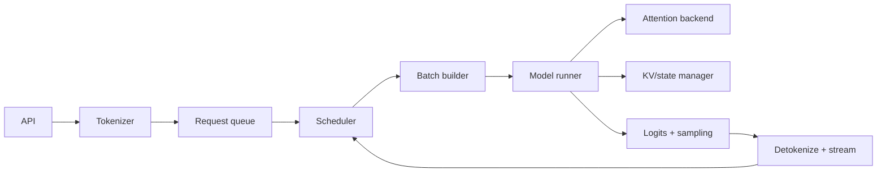

# Single-Node LLM Inference Engine

> **Role:** connect model execution and kernels to a complete token-serving engine
>
> **Prerequisite:** [`04-gpu-compiler-kernels.md`](04-gpu-compiler-kernels.md)
>
> **Boundary:** one host with one or more local accelerators; cluster orchestration comes later

[Roadmap index](README.md) ·
[GPU/compiler/kernels](04-gpu-compiler-kernels.md) ·
[KV/scheduling/serving](06-kv-scheduling-serving.md) ·
[Competency gates](COMPETENCY-GATES.md)

---

## Request Path



The engine is responsible for both semantic correctness and resource multiplexing.

---

## 1. From Framework Generation to an Engine

### 1.1 Framework generation

A simple Hugging Face generation loop usually:

- serves one local caller;
- owns one model instance;
- runs one batch at a time;
- uses a framework cache abstraction;
- has limited admission, preemption, or SLO logic.

It is the semantic reference, not the final serving architecture.

### 1.2 Inference engine responsibilities

- accept and validate requests;
- tokenize and apply chat templates;
- maintain request/session state;
- admit, queue, prioritize, and cancel;
- construct changing token batches;
- allocate and reclaim KV/state;
- select model and kernel backends;
- execute prefill and decode;
- sample and stream;
- expose metrics and errors.

### 1.3 Correctness invariants

- token positions and masks remain correct after batching/preemption;
- each sequence reads only its own allowed state;
- KV blocks are not reused before retirement;
- cancellation eventually reaches every stage;
- sampling uses the correct per-request configuration and RNG state;
- streamed tokens preserve request order;
- model/tokenizer/chat template are compatible.

---

## 2. Request and Sequence State

Track:

```text
request ID
prompt token IDs
generated token IDs
position / sequence length
sampling and stopping configuration
priority / deadline / tenant
KV block table
prefill/decode status
streaming state
cancellation state
metrics timestamps
```

Distinguish:

- request: user-visible unit;
- sequence: one candidate generation path;
- sequence group: alternatives such as beam/best-of;
- engine iteration: one scheduler/model-runner cycle;
- token budget: maximum scheduled tokens in an iteration.

---

## 3. Prefill and Decode Execution

### 3.1 Prefill

The engine must:

- batch prompts with variable lengths;
- allocate state;
- choose chunking;
- execute prompt tokens;
- store per-layer state;
- produce next-token logits.

Large prefill improves utilization but can block interactive decode.

### 3.2 Decode

At each iteration:

- select active sequences;
- prepare last-token inputs and positions;
- construct block tables/metadata;
- execute one/few new tokens;
- append state;
- sample;
- stop, stream, or requeue.

### 3.3 Mixed-phase execution

An engine may mix prefill chunks and decode tokens in one iteration. This improves utilization but
creates:

- resource interference;
- heterogeneous attention shapes;
- scheduler complexity;
- TTFT versus ITL trade-offs;
- graph-capture challenges.

---

## 4. Continuous Batching

Static batching waits for a batch to finish. Continuous batching can remove finished sequences and
admit new work between token iterations.

### Scheduler inputs

- waiting requests;
- active sequences;
- token budget;
- KV capacity;
- priority/deadline;
- prefill chunks;
- preemption state;
- adapter/model locality;
- structured-output constraints.

### Scheduler outputs

```text
scheduled requests
tokens per request
prefill/decode phase
preemptions/resumptions
state allocation decisions
batch metadata
```

### Policies

- FCFS;
- priority;
- deadline-aware;
- shortest-remaining/predicted work;
- fairness-aware;
- decode-first;
- prefill-first;
- chunked/mixed policies.

No policy is universally best. Evaluate under declared arrival and length distributions.

---

## 5. KV/State Manager

### 5.1 Contiguous allocation

Simple but can:

- reserve for maximum length;
- fragment memory;
- make growth/migration expensive;
- reduce concurrency.

### 5.2 Block/paged allocation

Map logical token positions to physical blocks:

```text
sequence
→ logical block numbers
→ physical KV blocks
```

Benefits:

- incremental allocation;
- shared prefixes;
- preemption/migration;
- reduced external fragmentation.

Costs:

- block-table metadata;
- internal fragmentation;
- indirect/gather access;
- backend integration.

### 5.3 Lifecycle

```text
reserve
→ write
→ read
→ share / copy-on-write
→ evict / offload / migrate
→ retire
```

Every transition needs ownership and synchronization rules.

### 5.4 Capacity accounting

Account for:

- model weights;
- KV/state blocks;
- activations/workspace;
- CUDA Graph pools;
- communication buffers;
- quantization metadata;
- adapter weights;
- allocator reserve.

---

## 6. Model Runner

The model runner translates scheduler output into backend inputs:

- token IDs;
- positions;
- attention metadata;
- block tables;
- sequence lengths;
- cache slots;
- adapter/model selection;
- graph bucket;
- sampling metadata.

It then:

- invokes model execution;
- updates state;
- transfers/selects logits;
- returns results to scheduler/output handling.

Important boundaries:

```text
scheduler policy
↔ batch metadata
↔ model runner
↔ attention/kernel backend
↔ KV manager
```

A fast kernel cannot compensate for expensive or serialized metadata preparation.

---

## 7. Attention and Kernel Backend

Backend selection depends on:

- prefill versus decode;
- sequence lengths;
- KV layout;
- MHA/GQA/MQA/MLA;
- dtype/quantization;
- batch size;
- graph capture;
- accelerator generation.

Possible backends:

- FlashAttention;
- FlashInfer;
- Triton;
- CUTLASS/CuTe/vendor kernels;
- framework-native attention;
- specialized MLA/MoE paths.

Record which backend actually executes.

---

## 8. Logits, Sampling, and Output

### 8.1 Logits processing

May include:

- temperature;
- repetition/frequency penalties;
- vocabulary masks;
- structured-decoding masks;
- top-k/top-p/min-p;
- stop-token handling.

### 8.2 GPU versus CPU sampling

GPU sampling can avoid device synchronization/transfers but introduces kernels and state management.
CPU sampling can be simpler but may become a high-QPS bottleneck.

### 8.3 Streaming

Handle:

- incremental detokenization;
- Unicode/byte boundaries;
- stop strings spanning tokens;
- client disconnect;
- backpressure;
- cancellation;
- final usage accounting.

---

## 9. CPU/GPU Coordination

Potential CPU bottlenecks:

- tokenizer threads;
- Python scheduler;
- block-table construction;
- object allocation;
- RPC serialization;
- logits transfer;
- sampling;
- streaming callbacks.

Potential GPU idle causes:

- no admitted work;
- serialized preparation;
- synchronous copies;
- graph-bucket miss;
- allocator synchronization;
- communication barrier;
- uneven sequence/expert work.

Use an end-to-end timeline that aligns engine events with GPU activity.

---

## 10. Code-Reading Paths

### vLLM

Trace:

```text
API server
→ engine/client
→ scheduler
→ KV cache manager
→ GPU model runner
→ model executor
→ attention backend
→ sampling/output
```

Local source: `../RESOURCES/repos/vllm`.

### SGLang

Trace:

```text
server/runtime
→ tokenizer manager
→ scheduler
→ radix/prefix cache
→ model worker/runner
→ attention/MoE backend
→ sampling/streaming
```

Local source: `../RESOURCES/repos/sglang`.

### TensorRT-LLM

Read for:

- compiled engines;
- precision/backend selection;
- runtime buffers;
- in-flight batching;
- multi-GPU execution.

Local source: `../RESOURCES/repos/tensorrt-llm`.

Do not read a repository linearly. Follow one request and one token through exact source locations.

---

## Required Build — Minimal Engine

Implement a small engine with:

```text
request queue
continuous scheduler
prefill/decode distinction
token budget
block-based KV allocator
preemption/resumption
model runner interface
sampling
streaming or collected output
metrics
```

The model can be small. The purpose is to expose control and state transitions.

### Required evidence

- request lifecycle diagram;
- exact source paths for one production engine;
- scheduler simulator or implementation;
- KV allocator correctness tests;
- fragmentation and block-size evaluation;
- prefill/decode timeline;
- saturation and P50/P95/P99 metrics;
- cancellation and out-of-memory behavior;
- one case where higher throughput worsens tail latency.

---

## Exit Gate

You can:

1. trace a request from API to streamed tokens;
2. distinguish request, sequence, engine iteration, and token budget;
3. explain continuous batching and mixed prefill/decode;
4. implement a block-based KV allocator;
5. explain preemption and resumption correctness;
6. map scheduler output to model-runner inputs;
7. identify the executed attention/sampling backend;
8. diagnose CPU preparation and GPU idle gaps;
9. locate the equivalent components in vLLM or SGLang;
10. explain every major time, memory, and synchronization cost on one node.

---

**Previous:** [`04-gpu-compiler-kernels.md`](04-gpu-compiler-kernels.md) ·
**Next:** [`06-kv-scheduling-serving.md`](06-kv-scheduling-serving.md) ·
**Competency gates:** [`COMPETENCY-GATES.md`](COMPETENCY-GATES.md)
