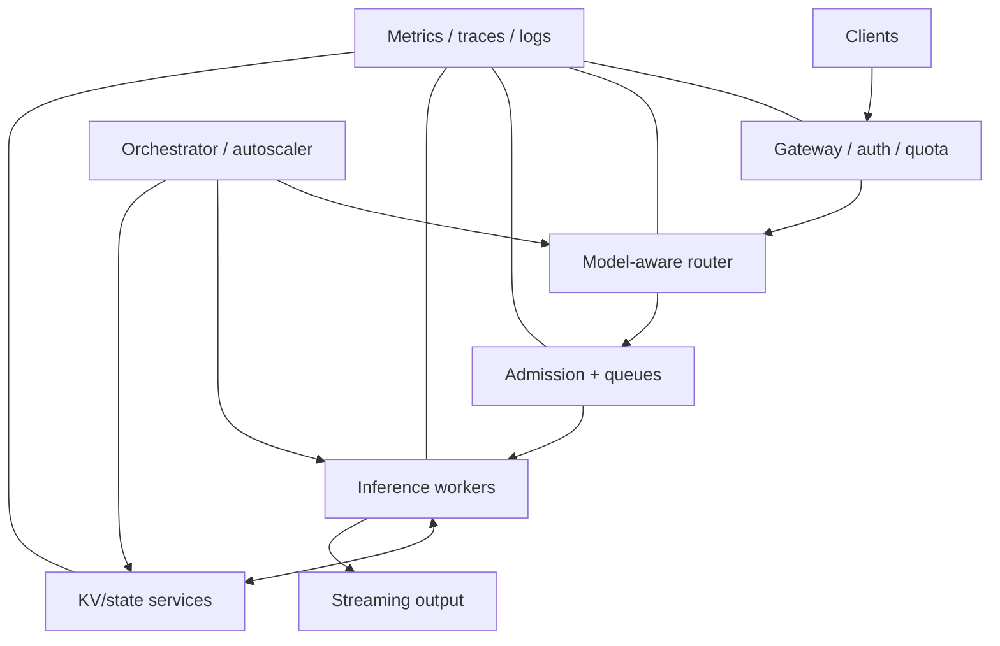

# Production Reliability and Operations for LLM Serving

> **Role:** extend an inference engine into an observable, recoverable, multi-tenant service
>
> **Prerequisite:** serving and distributed-inference mechanics
>
> **Outcome:** reason about overload, failures, recovery, isolation, cost, and operational boundaries

[Roadmap index](README.md) ·
[Serving systems](06-kv-scheduling-serving.md) ·
[Distributed inference and MoE](07-distributed-inference-moe.md) ·
[Bottleneck research](09-bottleneck-research.md) ·
[Competency gates](COMPETENCY-GATES.md)

---

## Production Stack



---

## 1. Service Contract

Declare:

- API and streaming semantics;
- supported models/adapters;
- input/output/context limits;
- sampling/stopping behavior;
- tenant and priority classes;
- latency SLOs;
- availability and durability expectations;
- overload behavior;
- cancellation and retry semantics;
- quality and safety constraints.

A production result is not defined by peak tokens/s alone.

### SLO metrics

```text
TTFT
ITL / TPOT
E2E latency
request success rate
SLO goodput
availability
cost per request / token
```

Report percentiles and error classes by workload/tenant, not only global averages.

---

## 2. Control Plane and Data Plane

### Control plane

- deployment specifications;
- model registry/versioning;
- placement and scaling;
- routing policy;
- quota and priority configuration;
- health/failure management;
- telemetry configuration.

### Data plane

- request admission;
- tokenization;
- inference execution;
- KV/state transfer;
- sampling/streaming;
- per-request cancellation.

The control plane should not enter the token critical path unnecessarily, but stale control-plane
state can still break placement, routing, or recovery.

---

## 3. Observability

### 3.1 Metrics

Frontend:

- request rate;
- payload/token lengths;
- validation/rejection;
- authentication/quota latency.

Queue/scheduler:

- queued requests/tokens;
- wait time;
- admitted/rejected work;
- priority/fairness;
- preemption.

Worker:

- prefill/decode batch composition;
- TTFT/ITL/E2E;
- tokens/s;
- GPU memory/utilization/power;
- graph/backend selection;
- kernel/communication time.

State:

- KV occupancy;
- block fragmentation;
- prefix hit/miss;
- bytes transferred;
- eviction/offload/recompute;
- stale metadata/failures.

Cluster:

- replica health;
- placement;
- network utilization;
- collective/transfer tails;
- autoscaling actions;
- cold-start state.

### 3.2 Distributed tracing

Trace timestamps across:

```text
gateway
→ routing
→ queue/admission
→ prefill
→ state transfer
→ decode iterations
→ sampling
→ streaming
```

Preserve request, session, model, worker, and state-transfer identifiers.

### 3.3 Logs

Logs should be structured and rate-limited. Avoid leaking prompts, generated text, credentials, or
tenant cache keys.

---

## 4. Admission, Backpressure, and Overload

### Admission signals

- queued tokens;
- predicted prompt/output work;
- KV capacity;
- SLO slack;
- priority/deadline;
- prefix/state locality;
- worker health;
- transfer/network pressure.

### Backpressure layers

```text
client limits
→ gateway rate limits
→ model admission
→ worker token budgets
→ KV capacity guards
→ transfer/network flow control
→ streaming backpressure
```

### Overload responses

- queue;
- reject early;
- shed low-priority work;
- reduce accepted context/output limits;
- route elsewhere;
- scale out;
- degrade an explicitly declared optional feature.

Unbounded queues convert overload into extreme P99 and timeouts.

---

## 5. Routing

Routing signals:

- queue/load;
- model/adapter locality;
- prefix/KV locality;
- GPU type/topology;
- predicted completion time;
- SLO/deadline;
- expert locality;
- worker health;
- cost/power.

Routing objective example:

```text
predicted queue time
+ execution time
+ cache miss / transfer cost
+ migration cost
+ SLO violation penalty
+ imbalance penalty
```

No single scalar objective is universally correct. State policy weights and fairness constraints.

---

## 6. Autoscaling and Cold Start

### Scaling signals

- arrival/request rate;
- input/output token rate;
- queued tokens;
- TTFT/ITL slack;
- KV occupancy;
- prefix hit rate;
- prefill/decode pool imbalance;
- expert load;
- GPU health.

### Cold-start components

```text
container scheduling
→ image pull/start
→ model-weight download
→ weight load
→ process/group initialization
→ graph/kernel compilation and warmup
→ state-service registration
→ cache warmup
```

Scale-to-zero may be incompatible with tight latency unless weights or state remain warm.

### Stability

Avoid:

- oscillation;
- scale decisions from delayed metrics;
- synchronized cold starts;
- overreaction to short token bursts;
- state-locality destruction during rebalancing.

---

## 7. Failure Model

Enumerate failure units:

| Failure unit | Possible effect |
|---|---|
| client/connection | cancellation, partial stream |
| gateway/router | lost routing state, retry |
| scheduler process | queued/active request loss |
| model worker | active sequence and local KV loss |
| one GPU/rank | TP/EP group failure |
| node | worker and local state loss |
| network path/NIC | transfer/collective timeout |
| KV/state tier | cache miss, stale metadata, unavailable state |
| storage/model registry | deployment/cold-start failure |
| control plane | stale placement or scaling |

Declare whether the system is fail-stop, crash-recovery, or expected to tolerate partial/Byzantine
behavior. Most inference systems assume fail-stop components.

---

## 8. Recovery Semantics

### Request recovery options

- fail the request;
- restart from prompt;
- resume from transferred KV/state;
- reconstruct state from token history;
- retry on another replica.

### Required questions

- which tokens were already streamed;
- whether replay can duplicate output;
- whether sampling is deterministic under replay;
- which RNG state is required;
- whether model/tokenizer/version is identical;
- whether cache-directory entries can be stale;
- whether partial KV writes are visible;
- how cancellation reaches old and new workers;
- how retry storms are controlled.

### Idempotency

API retries require an idempotency/request key if duplicate work or duplicate external effects matter.
Token streaming complicates transparent retry because the client may have observed a prefix.

### Distributed groups

A rank failure may invalidate the entire TP/EP group. Recovery choices include:

- group restart;
- spare rank;
- replica failover;
- elastic reconfiguration;
- capacity reduction.

Measure detection, teardown, reinitialization, weight/state restoration, and SLO recovery.

---

## 9. Multi-Tenancy and Isolation

### Resource isolation

- request/token quotas;
- priority and fairness;
- per-tenant concurrency;
- KV/cache capacity;
- adapter/model memory;
- network/state bandwidth;
- GPU time.

### State isolation

Prevent:

- cross-tenant prefix reuse without authorization;
- cache-key collisions;
- stale state after tenant/model version changes;
- prompt/KV leakage through logs or metrics;
- use-after-free of shared blocks;
- unsafe adapter/model mixing.

### Side channels

Shared queues, cache hits, timing, and resource pressure can reveal information. State the threat model
and avoid claiming security from performance isolation alone.

---

## 10. Deployment and Supply Chain

Track:

- container image digest;
- model/checkpoint digest;
- tokenizer and chat-template version;
- compiler/kernel artifacts;
- runtime and driver versions;
- configuration and feature flags;
- secrets and credentials;
- dependency provenance.

Validate model artifacts before loading. Treat remote model code and custom kernels as executable
software.

Rollout strategies:

- canary;
- shadow traffic;
- blue/green;
- gradual tenant/workload rollout;
- rollback with compatible state rules.

---

## 11. Cost, Energy, and Capacity

Report:

```text
tokens / second
requests / second
SLO goodput
tokens / dollar
tokens / joule
peak and average power
accelerator-hours
reserved and active memory
network/storage traffic
```

Capacity planning requires workload distributions:

- prompt/output length;
- arrival/burst pattern;
- prefix reuse;
- model mix;
- priority/SLO;
- failure/headroom assumptions.

Higher utilization can reduce cost but worsen tail latency or recovery headroom.

---

## 12. Required Evidence

Produce:

1. service-contract table;
2. production request/control-path diagram;
3. metric and trace schema;
4. overload curve through saturation;
5. admission/backpressure behavior;
6. cold-start decomposition;
7. autoscaling response;
8. failure matrix;
9. one failure-recovery trace;
10. cancellation/retry correctness result;
11. tenant/state-isolation checklist;
12. cost/capacity model.

The evaluation should include cases where the opportunity is absent and where a recovery mechanism
adds overhead.

---

## Exit Gate

You can:

1. define a measurable serving SLO;
2. separate control-plane and data-plane responsibilities;
3. design metrics/traces that locate queue, execution, transfer, and recovery cost;
4. explain admission, backpressure, load shedding, and overload behavior;
5. select routing and autoscaling signals without relying only on GPU utilization;
6. decompose cold start;
7. enumerate failure units and recovery semantics;
8. reason about replay, streaming, sampling, and state recovery;
9. define tenant and state isolation boundaries;
10. report performance, cost, energy, and capacity without hiding SLO regressions.

---

## Primary Resources

- [`../COURSE/MLSYS-VOL2.pdf`](../COURSE/MLSYS-VOL2.pdf)
- [MLSysBook](https://github.com/harvard-edge/cs249r_book)
- [Efficient Deep Learning Systems](https://github.com/mryab/efficient-dl-systems)
- [Dynamo](https://github.com/ai-dynamo/dynamo)
- [llm-d](https://github.com/llm-d/llm-d)
- [AIBrix](https://github.com/vllm-project/aibrix)
- [KServe](https://github.com/kserve/kserve)

---

**Previous:** [`07-distributed-inference-moe.md`](07-distributed-inference-moe.md) ·
**Next:** [`09-bottleneck-research.md`](09-bottleneck-research.md) ·
**Competency gates:** [`COMPETENCY-GATES.md`](COMPETENCY-GATES.md)
