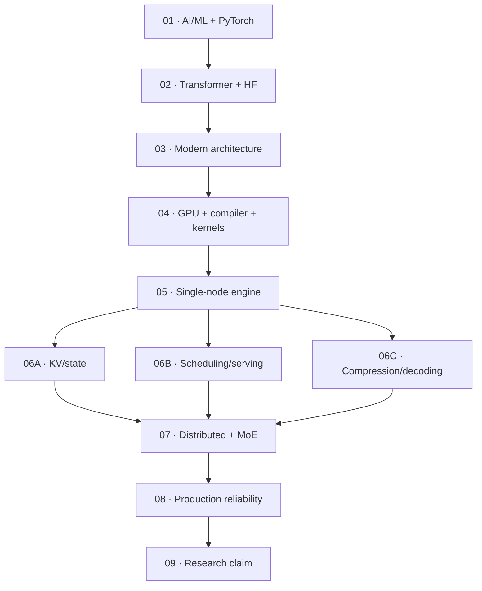

# Competency Gates

> **Role:** verify the numbered roadmap layers with concrete evidence
>
> **Rule:** a layer is complete only when its exit gate can be defended
>
> **Non-goal:** this document is not a calendar, schedule, or second teaching outline

[Roadmap index](README.md) ·
[Overview](00-roadmap.md) ·
[Foundation entry](01-ai-ml-foundations.md) ·
[Research map](09-bottleneck-research.md)

---

## Gate Map



Use the first gate whose exit criterion cannot be defended. Select only the 06 specialization
branches relevant to the intended research direction.

---

## Gate 01 — AI, ML, and PyTorch Foundations

**Reference:** [`01-ai-ml-foundations.md`](01-ai-ml-foundations.md)

### Required evidence

- linear-layer and matrix-multiplication shape derivation;
- manual softmax and cross-entropy calculation;
- small classifier with training and validation metrics;
- MLP with a non-linearity and normalization/residual component;
- tiny next-token model;
- gradient, parameter, activation, and model-state inspection;
- saved and correctly reloaded `state_dict`;
- reproducibility record.

### Exit gate

You can:

1. distinguish AI, machine learning, deep learning, and language modeling;
2. derive tensor shapes through linear layers;
3. explain logits, softmax, cross entropy, and maximum likelihood;
4. explain forward, backward, gradients, and optimizer updates;
5. distinguish parameters, activations, gradients, optimizer state, and inference state;
6. write PyTorch training and evaluation loops;
7. inspect shape, dtype, device, stride, and autograd state;
8. separate model-quality metrics from systems metrics.

---

## Gate 02 — Transformer and Hugging Face Foundations

**Reference:** [`02-transformer-foundations.md`](02-transformer-foundations.md)

### Required evidence

- two-token, one-head causal-attention calculation;
- minimal decoder block with shape assertions;
- minimal autoregressive language model;
- cached and uncached generation with matching logits;
- parameter/FLOP/KV ledger;
- Hugging Face tokenizer/config/model/generation inspection;
- exact source paths for attention, FFN, normalization, RoPE, and cache update.

### Exit gate

Given a model configuration, you can:

```text
derive Q/K/V shapes
reconstruct one decoder block
explain causal masking
calculate parameter and KV bytes
distinguish training, prefill, and decode
implement autoregressive generation
explain sampling/stopping
trace AutoModelForCausalLM to model-family source
```

`model.generate()` is no longer a black box.

---

## Gate 03 — Modern Architecture as a Systems Cost

**Reference:** [`03-modern-llm-architecture.md`](03-modern-llm-architecture.md)

### Required evidence

Build an architecture delta matrix for:

- MHA → GQA → MQA;
- conventional attention → MLA;
- full attention → sliding-window/sparse/hybrid attention;
- dense FFN → sparse MoE;
- attention → recurrent/SSM/hybrid state;
- one-token head → MTP/speculative-friendly heads;
- fixed depth → dynamic depth;
- autoregressive → iterative/diffusion generation;
- BF16/FP16 → FP8/INT8/INT4-style execution.

For each delta, record:

```text
semantic change
weight capacity
persistent state
bytes and FLOPs per token
kernel/compiler requirements
parallelism and communication
prefill/decode behavior
quality constraint
```

### Exit gate

Given an unfamiliar configuration, you can predict dominant serving costs and identify the model,
compiler, kernel, and engine paths needed to verify the prediction.

---

## Gate 04 — GPU, Compiler, and Kernels

**Reference:** [`04-gpu-compiler-kernels.md`](04-gpu-compiler-kernels.md)

### Required evidence

- Roofline-style operator cost sheet;
- annotated PyTorch/Nsight trace;
- one modified Triton or CUDA kernel;
- correctness and multi-shape measurements;
- one negative/regression case;
- eager-versus-compiled comparison;
- graph-break/recompilation case;
- generated code or compiler IR inspection;
- backend-specific assumption list.

### Exit gate

Before changing code, you can predict whether a target is limited by:

```text
arithmetic throughput
memory traffic
launch/dispatch
compiler specialization
synchronization
communication
insufficient parallelism
```

You can then identify profiler/compiler evidence that would falsify the prediction.

---

## Gate 05 — Single-Node Inference Engine

**Reference:** [`05-single-node-inference-engine.md`](05-single-node-inference-engine.md)

### Required evidence

- one current vLLM or SGLang baseline;
- exact environment and workload contract;
- request execution-path note with source locations;
- continuous scheduler implementation or simulator;
- block-based KV allocator with correctness tests;
- preemption/resumption path;
- prefill/decode profiler comparison;
- saturation and P50/P95/P99 metrics;
- CPU-control and GPU-execution timeline.

### Required request trace

```text
API
→ tokenizer
→ queue/admission
→ scheduler
→ batch builder
→ model runner
→ attention backend
→ KV manager
→ logits/sampling
→ detokenize/stream
```

### Exit gate

You can explain every major time, memory, state, and synchronization cost for one request on one
node, including CPU control-plane overhead and GPU idle gaps.

---

## Gate 06A — KV and Inference-State Systems

**Reference:** [`06-kv-scheduling-serving.md`](06-kv-scheduling-serving.md)

### Required evidence

- KV capacity under MHA/GQA/MQA/MLA;
- contiguous versus paged allocation comparison;
- fragmentation and block-size sensitivity;
- prefix reuse, admission, eviction, and prefetch policy;
- HBM/peer/host/storage/remote tier model;
- transfer-versus-recompute boundary;
- migration, preemption, and failure-recovery behavior.

### Exit gate

You can select a state policy from locality, context distribution, bandwidth, capacity, correctness,
failure model, and SLO—not from cache hit rate alone.

---

## Gate 06B — Online Serving and Scheduling

**Reference:** [`06-kv-scheduling-serving.md`](06-kv-scheduling-serving.md)

### Required evidence

- open-loop and closed-loop workloads;
- FCFS, priority, fairness, and deadline policy comparison;
- head-of-line-blocking analysis;
- chunked-prefill/decode interference;
- admission, backpressure, and load-shedding behavior;
- P50/P95/P99 TTFT, ITL, E2E, goodput, fairness, and starvation;
- simulator-versus-real-system calibration.

### Exit gate

You can identify saturation, explain tail-latency collapse, and show whether a policy improves SLO
goodput without shifting cost to another request class.

---

## Gate 06C — Compression and Decoding

**References:** [`../QUANT/README.md`](../QUANT/README.md),
[`../SPEC/README.md`](../SPEC/README.md), and
[`06-kv-scheduling-serving.md`](06-kv-scheduling-serving.md)

### Required evidence

- weight-only, weight-activation, and KV quantization comparison;
- calibration/outlier/scale/dequantization/kernel inspection;
- speculative draft/verification/acceptance/rollback model;
- model/head/feature/n-gram/prompt proposal comparison;
- quality, memory, latency, throughput, and batch interaction;
- explicit break-even and regression regions.

### Exit gate

You can state the quality contract and exact workload/backend region where a compression or decoding
mechanism helps or regresses.

---

## Gate 07 — Distributed Inference and MoE

**Reference:** [`07-distributed-inference-moe.md`](07-distributed-inference-moe.md)

### Required evidence

Dense/distributed:

- memory and communication derivation for DP, TP, PP, CP/SP;
- collective and point-to-point cost model;
- topology diagram;
- per-rank memory ledger;
- parallelism calculator;
- disaggregation break-even analysis;
- measured-versus-predicted comparison.

MoE:

- routing and tokens-per-expert trace;
- router → dispatch → grouped GEMM → combine trace;
- padded/grouped/sparse/fused expert-kernel comparison;
- EP communication and topology model;
- skew, hot expert, max-rank tail, placement, and replication analysis;
- separate prefill and decode behavior.

### Exit gate

Given a model, workload, accelerator topology, and SLO, you can choose and defend parallelism and
placement. For MoE, you can explain why sparse active FLOPs do not imply sparse storage, memory
traffic, communication, or latency.

---

## Gate 08 — Production Reliability and Operations

**Reference:** [`08-production-reliability.md`](08-production-reliability.md)

### Required evidence

- service/SLO contract;
- request and control-plane map;
- metrics, trace, and log schema;
- overload curve;
- admission/backpressure behavior;
- cold-start decomposition;
- autoscaling response;
- failure matrix;
- failure/recovery trace;
- cancellation/retry correctness;
- tenant/state-isolation checklist;
- cost and capacity model.

### Exit gate

You can explain service behavior under overload, cold start, partial failure, retry, and multi-tenant
contention—and show that recovery preserves the declared correctness and SLO contract.

---

## Gate 09 — Bottleneck-Driven Research

**References:** [`09-bottleneck-research.md`](09-bottleneck-research.md) and
[`10-research-projects.md`](10-research-projects.md)

### Required sequence

1. Define workload, hardware/topology, software, quality constraint, and SLO.
2. Identify a dominant resource or queue using measurement.
3. Reproduce the strongest relevant baseline.
4. State a falsifiable hypothesis.
5. Build a mechanism that attacks the measured bottleneck.
6. Evaluate baselines, ablations, stress cases, and negative cases.
7. Identify the break-even boundary.
8. Package commands, configs, raw results, and analysis.

### Required evidence

```text
problem statement and non-goals
workload contract
bottleneck evidence
cost model
mechanism and invariants
strong baselines
ablations
stress and negative cases
quality/correctness
limitations and boundary
reproduction instructions
```

### Exit gate

An independent reader can reproduce the main result and distinguish:

- observation from assumption;
- systems improvement from quality change;
- average speedup from SLO goodput;
- mechanism benefit from workload selection;
- measured boundary from claimed generality.

---

## Hardware-Aware Validation

| Available environment | Useful evidence |
|---|---|
| no GPU | math, cost models, source traces, schedulers, calibrated simulation |
| one GPU | kernels, compilation, KV allocation, batching, single-node serving |
| temporary remote GPU | pre-validated high-information comparisons |
| multi-GPU node | collectives, TP/EP, topology, placement, overlap |
| multi-node cluster | disaggregation, routing, failure, cross-node tail behavior |

Do not treat checkpoint downloads, repository count, or isolated peak throughput as competency
evidence. Prefer the smallest model and environment that expose the mechanism.

---

**Roadmap overview:** [`00-roadmap.md`](00-roadmap.md) ·
**Foundation entry:** [`01-ai-ml-foundations.md`](01-ai-ml-foundations.md) ·
**Project catalog:** [`10-research-projects.md`](10-research-projects.md)
