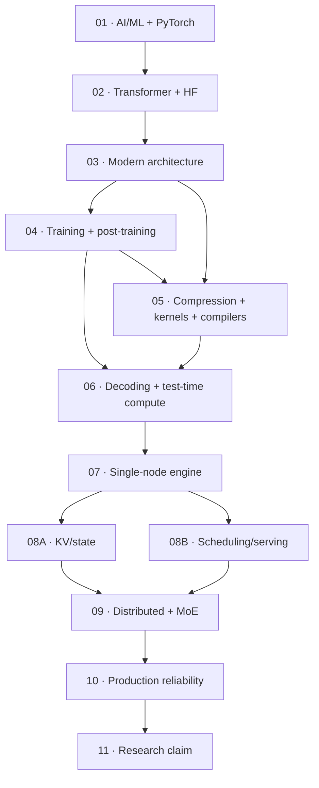

# Competency Gates

> **Role:** verify that the numbered roadmap layers can be explained, traced and evaluated
>
> **Non-goal:** this is not a calendar, tutorial, exercise plan or mandatory project list

[Roadmap index](README.md) ·
[Overview](00-roadmap.md) ·
[Foundation entry](01-ai-ml-foundations.md) ·
[Research map](11-bottleneck-research.md)

---

## Gate Map



Use the first gate whose criteria cannot already be defended. Evidence can be a derivation, a
source trace, an existing artifact, a profiler/benchmark record or a published reproduction; this
document does not require creating a new experiment for every topic.

---

## Gate 01 — AI, ML, and PyTorch Foundations

**Reference:** [`01-ai-ml-foundations.md`](01-ai-ml-foundations.md)

You can:

- derive matrix/linear-layer shapes and explain broadcasting;
- calculate softmax, cross entropy and maximum likelihood on a small example;
- explain forward, backward, gradients and optimizer updates;
- distinguish parameters, activations, gradients, optimizer state and inference state;
- distinguish training, validation, generalization and inference;
- inspect shape, dtype, device, stride and autograd state in PyTorch;
- explain save/load state and reproducibility controls;
- separate model-quality metrics from systems metrics.

---

## Gate 02 — Transformer and Hugging Face Foundations

**Reference:** [`02-transformer-foundations.md`](02-transformer-foundations.md)

Given a model configuration, you can:

- derive Q/K/V, attention-score and output shapes;
- explain causal masking, position encoding, FFN, residual and normalization;
- explain tokenization, special tokens, chat templates and next-token likelihood;
- distinguish encoder-only, encoder-decoder and decoder-only execution;
- distinguish training, prefill and decode;
- calculate parameter, activation and KV/state bytes;
- explain cached and uncached autoregressive generation;
- explain ordinary sampling and stopping;
- trace `AutoModelForCausalLM`, configuration, cache and generation to model-family source.

`model.generate()` is no longer a black box.

---

## Gate 03 — Modern Architecture as a Systems Cost

**Reference:** [`03-modern-llm-architecture.md`](03-modern-llm-architecture.md)

For an unfamiliar configuration, you can identify and cost:

- MHA, GQA, MQA and MLA;
- RoPE/ALiBi/context-extension choices;
- per-layer KV versus CLA/MLKV/YOCO-style sharing;
- full, sliding-window, sparse, retrieval and hybrid attention;
- softmax attention versus linear/recurrent/SSM state;
- dense FFN versus MoE and conditional depth;
- MTP/speculative heads and early-exit support;
- autoregressive versus iterative/diffusion generation;
- text-only versus multimodal encoder/projector/token streams;
- model-defined numerical precision and quantization metadata.

For each delta you can state:

```text
semantic change
weight and persistent-state capacity
bytes and FLOPs per token
kernel/compiler requirement
parallelism and communication
prefill/decode/encode behavior
quality and compatibility constraint
```

---

## Gate 04 — Training and Post-Training Systems

**Reference:** [`04-training-post-training-systems.md`](04-training-post-training-systems.md)

You can distinguish and trace:

- acquisition, extraction, filtering, deduplication, decontamination and data mixture;
- tokenizer training, sequence fertility, packing, boundaries and loss masks;
- causal/masked/span/FIM/multimodal objectives;
- scaling-law assumptions and compute/data constrained regimes;
- parameters, gradients, optimizer state, activations and communication buffers;
- DDP, FSDP/ZeRO, TP, PP, CP/SP and EP;
- mixed precision, activation checkpointing and distributed checkpoint/resume;
- continued pretraining, SFT, LoRA/QLoRA and adapter merge/runtime serving;
- preference data, reward models and outcome/process feedback;
- DPO-family offline objectives versus PPO/GRPO-family online RL;
- rollout generation, reward evaluation, weight synchronization and stale-policy behavior;
- how tokenizer, architecture, precision, MTP/MoE and checkpoint choices constrain inference.

For RL/reasoning pipelines, you can trace:

```text
prompt/environment
→ rollout engine
→ tool/environment interaction
→ reward/verifier
→ trajectory statistics
→ policy update
→ weight publication
```

---

## Gate 05 — Single-Node Inference Optimization

**Reference:** [`05-single-node-inference-optimization.md`](05-single-node-inference-optimization.md)

Before accepting an optimization claim, you can:

- derive parameter, activation, KV/state, workspace, FLOP and byte costs;
- reconcile formula, allocator and profiler memory;
- distinguish semantic/model, representation, algorithm, kernel, compiler and runtime changes;
- distinguish weight, activation, KV, attention and expert quantization;
- compare PTQ/QAT, scale granularity, calibration, outliers, packing and dequantization;
- distinguish unstructured, N:M and structured sparsity from deployed sparse kernels;
- classify KV quantization, selection, eviction, compression, retrieval, tiering and offload;
- distinguish GQA/MQA, MLA and cross-layer sharing;
- distinguish sparse/linear/recurrent attention from exact FlashAttention-style IO optimization;
- locate CUDA/Triton/CUTLASS/CuTe kernels and compiler-generated code/IR;
- identify eager/compiled/graph-captured paths, specialization and fallback;
- state supported hardware, dtype, layout and shape;
- state quality/correctness, end-to-end impact and regression/break-even region.

---

## Gate 06 — Decoding, Speculative Execution, and Test-Time Compute

**Reference:** [`06-decoding-test-time-compute.md`](06-decoding-test-time-compute.md)

You can distinguish:

- greedy, stochastic sampling, beam/contrastive search and best-of-N;
- logits processing from model-forward execution;
- constrained/structured generation from ordinary sampling;
- exact speculative decoding from approximate accelerated decoding;
- independent draft, self-speculative, MTP/Medusa, EAGLE, retrieval/N-gram, tree, long-context and
  diffusion/block drafters;
- lookahead/Jacobi parallel decoding from classic draft-target speculation;
- a diffusion LM target from a diffusion speculative drafter;
- latency-reducing speculation from quality-seeking test-time compute;
- reasoning search from agent/tool multi-call execution.

You can trace:

```text
proposal
→ target verification
→ acceptance / residual sampling
→ provisional KV/state commit or rollback
→ scheduler and batch update
```

You can also explain:

- draft/target placement and memory;
- verification masks/kernels and tree/ragged shapes;
- tokenizer/vocabulary compatibility;
- grammar state under speculation;
- batching, CUDA Graph, TP, MoE, quantization and prefix-cache interaction;
- distribution-parity or greedy-parity validation;
- why acceptance rate alone does not predict TTFT/TPOT/E2E/goodput;
- how to report break-even across workload, batch, context and hardware;
- quality–latency–cost metrics for test-time reasoning.

---

## Gate 07 — Single-Node Inference Engine

**Reference:** [`07-single-node-inference-engine.md`](07-single-node-inference-engine.md)

You can trace one request through:

```text
API/frontend
→ tokenizer/input processor
→ queue/admission
→ scheduler
→ batch builder
→ model runner
→ attention/backend
→ KV/state manager
→ logits/structured/speculative path
→ sampling
→ detokenize/stream
```

You can identify:

- request/sequence state transitions;
- continuous batching and chunked prefill;
- paged/block KV allocation and release;
- preemption, recomputation, swap and resume;
- eager and CUDA Graph execution;
- CPU control-plane overhead and GPU idle gaps;
- one readable engine path and the corresponding production path;
- correctness and workload requirements of any reported performance result.

---

## Gate 08A — KV and Inference-State Systems

**Reference:** [`08-kv-scheduling-serving.md`](08-kv-scheduling-serving.md)

You can:

- calculate KV/state under MHA/GQA/MQA/MLA and cross-layer sharing;
- compare contiguous, paged and virtual allocation;
- explain fragmentation and block-size effects;
- distinguish prefix reuse from model-semantic KV reduction;
- define admission, retention, eviction, prefetch and migration;
- model HBM, peer, host, storage and remote tiers;
- locate the transfer-versus-recompute boundary;
- reason about provisional speculative state and multi-branch reasoning state;
- preserve correctness through preemption, migration and failure.

---

## Gate 08B — Online Serving and Scheduling

**Reference:** [`08-kv-scheduling-serving.md`](08-kv-scheduling-serving.md)

You can:

- distinguish open-loop and closed-loop load generation;
- define TTFT, TPOT/ITL, E2E, throughput, goodput and fairness;
- explain continuous batching, chunked prefill and head-of-line blocking;
- compare FCFS, priority, deadline and fair policies;
- define admission, backpressure and load shedding;
- schedule ordinary, structured, speculative, multimodal and reasoning requests;
- explain encode/prefill/decode and prefill/decode disaggregation;
- reason about prefix/cache-aware routing and multi-model/adapter placement;
- identify saturation and tail-latency collapse;
- interpret simulator results only after calibration to a real engine.

---

## Gate 09 — Distributed Inference and MoE

**Reference:** [`09-distributed-inference-moe.md`](09-distributed-inference-moe.md)

For dense/distributed inference, you can:

- derive per-rank memory and communication for DP/replicas, TP, PP and CP/SP;
- map collective and point-to-point traffic to topology;
- distinguish PCIe, NVLink/NVSwitch and inter-node fabric regimes;
- explain communication/compute overlap and decode-specific small-message costs;
- reason about prefill/decode, remote KV and draft/target disaggregation;
- select parallelism from model, workload, topology and SLO.

For MoE, you can:

- trace router → permutation/dispatch → grouped/fused GEMM → combine;
- distinguish token-choice, expert-choice, shared and fine-grained experts;
- explain capacity, dropping, auxiliary balance and auxiliary-loss-free routing;
- model EP all-to-all payload and synchronization;
- identify skew, hot experts, max-rank tail and topology effects;
- compare placement, replication, caching/offload and disaggregated experts;
- separate prefill and decode behavior;
- explain why sparse active FLOPs do not imply sparse storage, traffic or latency.

---

## Gate 10 — Production Platform and Reliability

**Reference:** [`10-production-reliability.md`](10-production-reliability.md)

You can explain:

- API gateway, authentication, quotas, routing and admission;
- model registry, artifact lineage, checkpoint conversion and supply-chain controls;
- loading, cold start, warm pools, multi-model placement and adapter lifecycle;
- control plane versus data plane;
- metrics, traces, logs and correctness canaries;
- overload, backpressure, degradation and autoscaling;
- worker/GPU/node/network/cache failure detection and recovery;
- cancellation, retry, replay, idempotency and state consistency;
- tenant isolation, privacy and security;
- safe rollout/rollback and version compatibility;
- capacity, cost and energy at an explicit SLO.

---

## Gate 11 — Bottleneck-Driven Research

**Reference:** [`11-bottleneck-research.md`](11-bottleneck-research.md)

A defensible research claim contains:

```text
problem statement and non-goals
workload / model / hardware / topology / software contract
quality, correctness and SLO contract
measured bottleneck evidence
cost model
mechanism and invariants
strong baselines
ablations or causal isolation
stress and negative cases
break-even boundary
limitations
reproduction instructions and raw evidence
```

An independent reader can distinguish:

- observation from assumption;
- algorithm/model change from systems optimization;
- quality change from performance change;
- average speedup from tail latency and SLO goodput;
- isolated kernel improvement from end-to-end service impact;
- mechanism benefit from workload selection;
- measured boundary from claimed generality.

---

## Hardware-Aware Evidence

| Available environment | Useful evidence |
|---|---|
| no accelerator | derivations, cost models, source traces, correctness reasoning and calibrated simulation |
| one GPU | kernels, compilation, KV allocation, batching and single-node serving |
| temporary remote GPU | pre-defined high-information comparisons |
| multi-GPU node | collectives, TP/EP, topology, placement and overlap |
| multi-node cluster | disaggregation, routing, failure and cross-node tail behavior |

Repository count, checkpoint downloads and isolated peak throughput are not competency evidence.

---

**Roadmap overview:** [`00-roadmap.md`](00-roadmap.md) ·
**Foundation entry:** [`01-ai-ml-foundations.md`](01-ai-ml-foundations.md)
