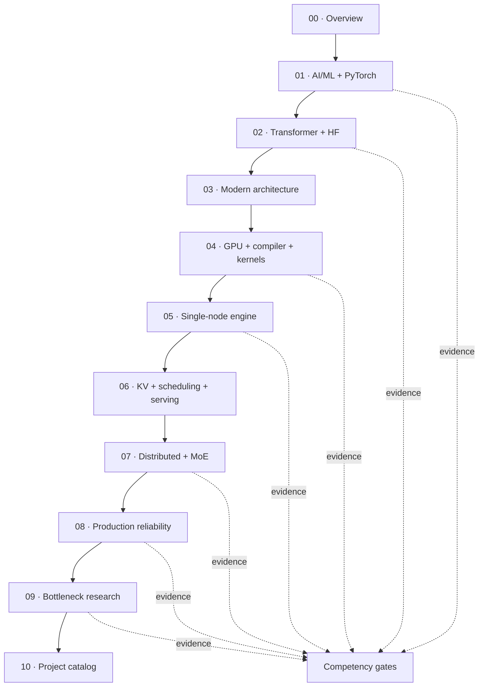

# LLM Inference & AI Systems Roadmap

> **Target:** Database / systems researcher → LLM inference and AI systems researcher
>
> **Organization:** foundations → model → hardware/runtime → engine → serving → cluster → research
>
> **Progress model:** concepts, required builds, evidence, and exit gates; no calendar schedule

## Main Path

| Layer | Document | Core question |
|---:|---|---|
| 00 | [`00-roadmap.md`](00-roadmap.md) | What is the complete field map and where should I enter? |
| 01 | [`01-ai-ml-foundations.md`](01-ai-ml-foundations.md) | How do tensors, neural networks, loss, gradients, and PyTorch work? |
| 02 | [`02-transformer-foundations.md`](02-transformer-foundations.md) | How does a Transformer predict and generate tokens, including Hugging Face usage? |
| 03 | [`03-modern-llm-architecture.md`](03-modern-llm-architecture.md) | How do modern architecture choices change systems cost? |
| 04 | [`04-gpu-compiler-kernels.md`](04-gpu-compiler-kernels.md) | How does model code become efficient accelerator execution? |
| 05 | [`05-single-node-inference-engine.md`](05-single-node-inference-engine.md) | How does one node multiplex requests, execution, and KV state? |
| 06 | [`06-kv-scheduling-serving.md`](06-kv-scheduling-serving.md) | How do cache, scheduling, decoding, and serving policies interact? |
| 07 | [`07-distributed-inference-moe.md`](07-distributed-inference-moe.md) | How do parallelism, topology, communication, and MoE scale inference? |
| 08 | [`08-production-reliability.md`](08-production-reliability.md) | How does a serving system handle overload, failures, isolation, and cost? |
| 09 | [`09-bottleneck-research.md`](09-bottleneck-research.md) | How is a measured bottleneck converted into a defensible research claim? |
| 10 | [`10-research-projects.md`](10-research-projects.md) | Which bounded project formulations fit the identified bottleneck? |

## Evaluation Layer

[`COMPETENCY-GATES.md`](COMPETENCY-GATES.md) is the cross-cutting evaluation document. It does not
replace the learning path. Use it to verify that each layer produced enough code, quantitative
reasoning, and evidence.

## Dependency Map



## Entry by Background

| Background | Entry |
|---|---|
| new to AI/ML | start at [`01-ai-ml-foundations.md`](01-ai-ml-foundations.md) |
| comfortable with PyTorch and training | start at [`02-transformer-foundations.md`](02-transformer-foundations.md) |
| understands decoder/KV mechanics | start at [`03-modern-llm-architecture.md`](03-modern-llm-architecture.md) |
| already builds models but lacks systems depth | start at [`04-gpu-compiler-kernels.md`](04-gpu-compiler-kernels.md) |
| already works on inference engines | use [`09-bottleneck-research.md`](09-bottleneck-research.md) to locate gaps |

Skipping a layer is valid only when its exit criteria can already be defended.

## Working Rule

Do not measure progress by pages read, repositories cloned, or topics named. Progress means:

```text
concept can be explained
→ mechanism can be implemented or traced
→ cost can be calculated
→ behavior can be measured
→ limitations can be stated
```

---

**Library home:** [`../README.md`](../README.md) ·
**Repository atlas:** [`../RESOURCES/GITHUB-REPO-ATLAS.md`](../RESOURCES/GITHUB-REPO-ATLAS.md) ·
**Source provenance:** [`../RESOURCES/SOURCES.md`](../RESOURCES/SOURCES.md)
