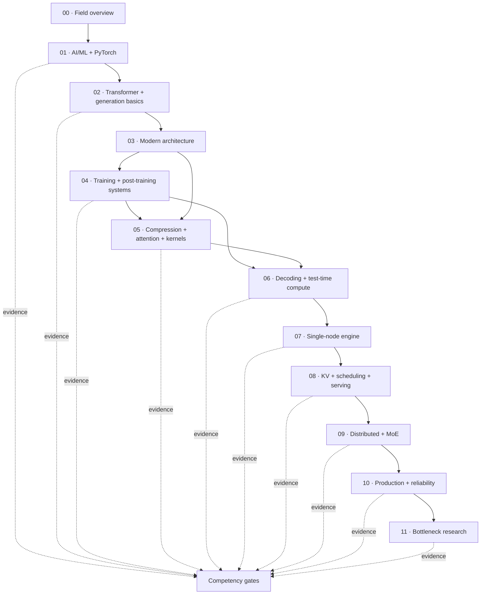

# LLM and AI Systems Research Roadmap

> **Audience:** database / systems researcher moving into LLM inference and AI systems
>
> **Format:** external English tutorial/documentation → representative paper → reference
> implementation → production source path
>
> **No calendar schedule. No locally rewritten tutorials.**

## Main Path

| Layer | Document | Core question |
|---:|---|---|
| 00 | [`00-roadmap.md`](00-roadmap.md) | What is the complete field structure, and where should I enter? |
| 01 | [`01-ai-ml-foundations.md`](01-ai-ml-foundations.md) | Which AI/ML, mathematics, neural-network and PyTorch foundations are required? |
| 02 | [`02-transformer-foundations.md`](02-transformer-foundations.md) | How does a Transformer train, prefill and generate tokens? |
| 03 | [`03-modern-llm-architecture.md`](03-modern-llm-architecture.md) | How do modern architecture choices change system cost? |
| 04 | [`04-training-post-training-systems.md`](04-training-post-training-systems.md) | How are data, pretraining, adaptation, preference learning and RL rollouts built and scaled? |
| 05 | [`05-single-node-inference-optimization.md`](05-single-node-inference-optimization.md) | Which compression, attention, kernel and compiler techniques remove a measured bottleneck? |
| 06 | [`06-decoding-test-time-compute.md`](06-decoding-test-time-compute.md) | How do sampling, constrained generation, speculative execution and reasoning-time compute differ and interact? |
| 07 | [`07-single-node-inference-engine.md`](07-single-node-inference-engine.md) | How does one node execute and multiplex requests and model state? |
| 08 | [`08-kv-scheduling-serving.md`](08-kv-scheduling-serving.md) | How do KV/state, scheduling, batching, routing and serving policies interact? |
| 09 | [`09-distributed-inference-moe.md`](09-distributed-inference-moe.md) | How do parallelism, topology, communication and MoE scale inference? |
| 10 | [`10-production-reliability.md`](10-production-reliability.md) | How are model lifecycle, overload, failures, isolation, security and cost handled? |
| 11 | [`11-bottleneck-research.md`](11-bottleneck-research.md) | How is an observed bottleneck converted into a defensible research question? |

## Dependency Map



## Topic Router

| Interest | Start here |
|---|---|
| new to AI/ML or PyTorch | [`01-ai-ml-foundations.md`](01-ai-ml-foundations.md) |
| Transformer and Hugging Face basics | [`02-transformer-foundations.md`](02-transformer-foundations.md) |
| GQA/MQA/MLA, MoE, linear attention, Mamba, diffusion LM | [`03-modern-llm-architecture.md`](03-modern-llm-architecture.md) |
| data, scaling laws, distributed training, SFT/DPO/GRPO/RLHF | [`04-training-post-training-systems.md`](04-training-post-training-systems.md) |
| quantization, KV eviction/compression, sparse/linear attention, FlashAttention, CUDA/Triton | [`05-single-node-inference-optimization.md`](05-single-node-inference-optimization.md) |
| sampling, structured output, Medusa/MTP/EAGLE, speculative decoding, reasoning compute | [`06-decoding-test-time-compute.md`](06-decoding-test-time-compute.md) |
| request path and engine internals | [`07-single-node-inference-engine.md`](07-single-node-inference-engine.md) |
| PagedAttention, prefix cache, continuous batching, scheduling and disaggregation | [`08-kv-scheduling-serving.md`](08-kv-scheduling-serving.md) |
| TP/PP/EP, NCCL, topology and MoE | [`09-distributed-inference-moe.md`](09-distributed-inference-moe.md) |
| lifecycle, cold start, multi-model, overload, fault tolerance and security | [`10-production-reliability.md`](10-production-reliability.md) |
| inference bottlenecks and research gaps | [`11-bottleneck-research.md`](11-bottleneck-research.md) |

## Cross-Cutting Branches

The path is text-LLM centered, but the system model explicitly includes:

- multimodal/VLM encode–prefill–decode requests;
- encoder, embedding and reranking workloads;
- diffusion and block-diffusion language models;
- structured/tool outputs and agent multi-call workflows;
- training-time rollout generation and inference–training co-design;
- CUDA, ROCm, TPU, CPU/edge, interconnect and heterogeneous backends;
- compiler/IR/runtime fallback;
- model lifecycle, multi-model placement and cold start;
- numerical, sampling, cache/state and recovery correctness.

See the coverage matrix in [`00-roadmap.md`](00-roadmap.md#4-cross-cutting-coverage-matrix).

## Working Rule

```text
external explanation
→ representative primary work
→ readable reference implementation
→ production implementation
→ predicted system cost
→ measured evidence
→ correctness / quality / SLO boundary
```

Reading pages, naming techniques and cloning repositories are not completion criteria.
[`COMPETENCY-GATES.md`](COMPETENCY-GATES.md) defines the evidence gates.

---

**Library home:** [`../README.md`](../README.md) ·
**Repository atlas:** [`../RESOURCES/GITHUB-REPO-ATLAS.md`](../RESOURCES/GITHUB-REPO-ATLAS.md) ·
**Source provenance:** [`../RESOURCES/SOURCES.md`](../RESOURCES/SOURCES.md)
